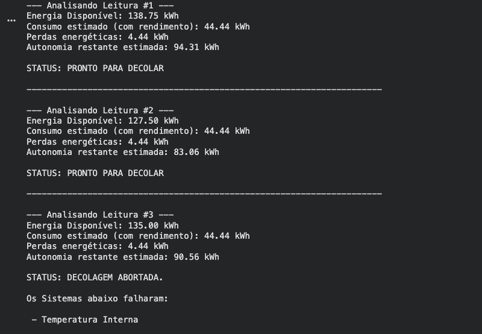
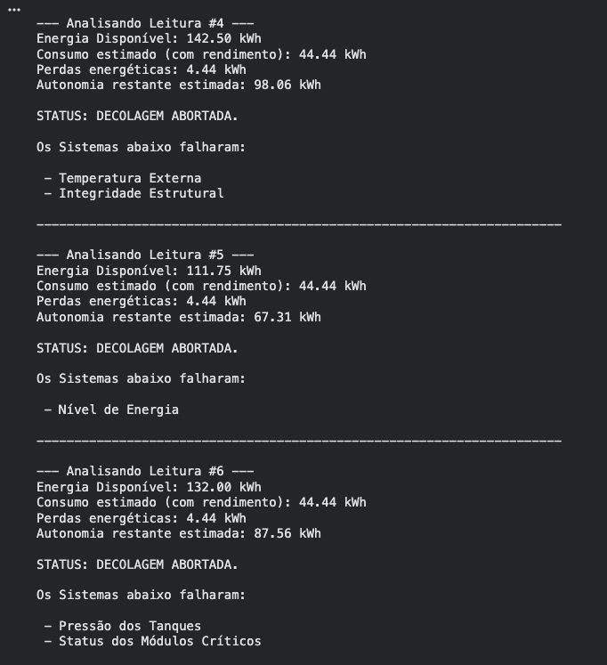
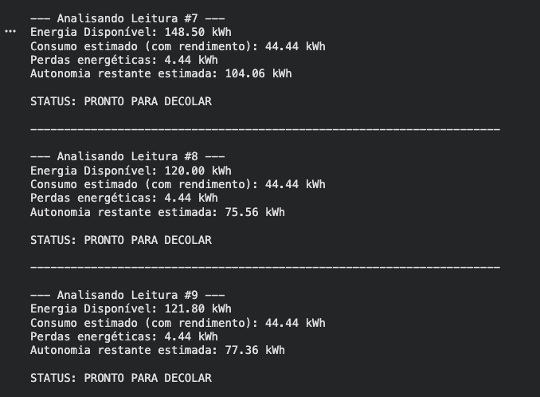
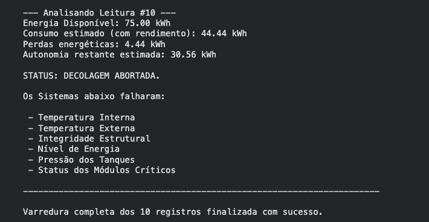
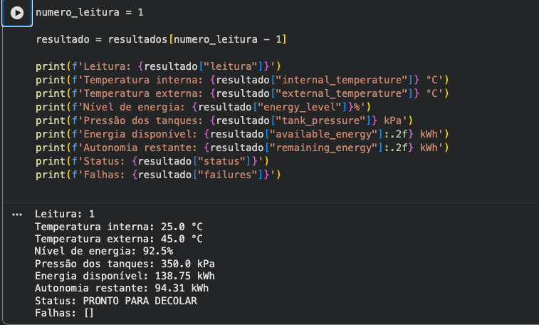
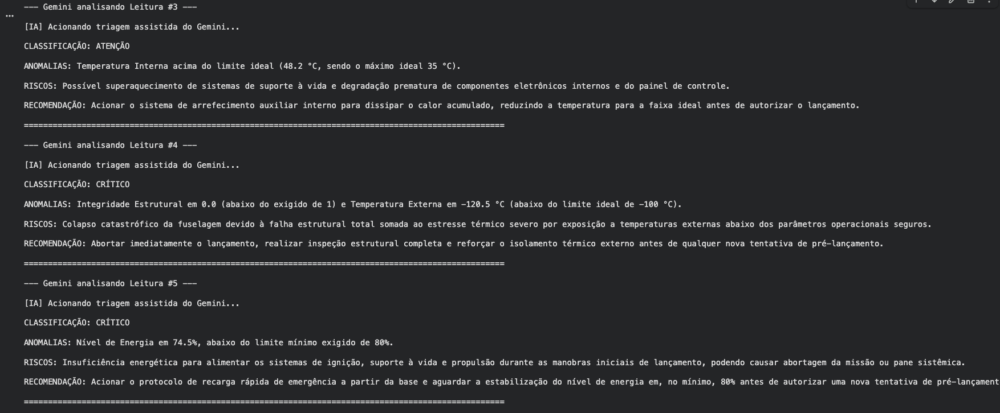
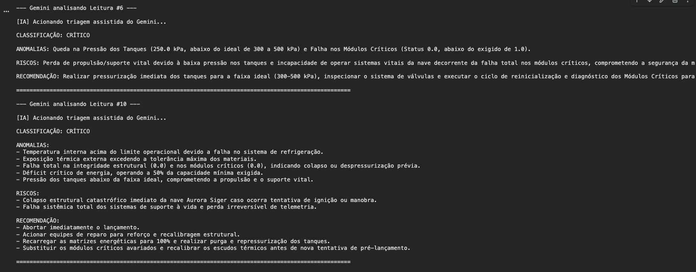
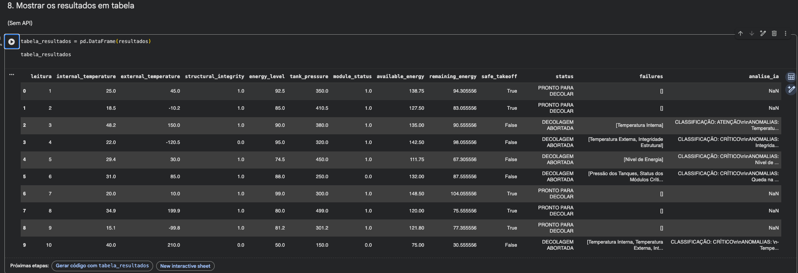

# 🚀 Missão Aurora Siger

Projeto desenvolvido para a **Fase 1 do curso de Ciência da Computação da FIAP**, com o objetivo de simular a etapa de pré-decolagem de um foguete por meio da leitura e análise de dados de telemetria.

O sistema processa os dados da nave, calcula informações de energia e verifica se os principais parâmetros estão dentro das faixas de segurança. Ao final de cada leitura, o programa determina se a missão está **PRONTA PARA DECOLAR** ou se a **DECOLAGEM DEVE SER ABORTADA**.

O projeto também possui uma integração **opcional** com a API do Google Gemini. A IA é utilizada somente como apoio para interpretar leituras que já apresentaram falha. A decisão de decolagem é feita pelas regras definidas no próprio código.

## 🎯 Objetivo do projeto

A Missão Aurora Siger reúne conteúdos estudados durante a fase em uma simulação de lançamento espacial, trabalhando com:

- leitura e organização de dados de telemetria;
- lógica de programação e estruturas condicionais;
- desenvolvimento em Python;
- análise de consumo e perdas de energia;
- identificação e registro de falhas;
- análise assistida por Inteligência Artificial;
- ética, responsabilidade e sustentabilidade tecnológica.

## 📡 Dados de telemetria

As leituras utilizadas na simulação estão no arquivo:

```text
telemetry_aurora.csv
```

O conjunto contém **10 registros**, com os seguintes parâmetros:

| Parâmetro | Faixa considerada segura |
|---|---|
| Temperatura interna | 15 °C a 35 °C |
| Temperatura externa | -100 °C a 200 °C |
| Integridade estrutural | 1 |
| Nível de energia | mínimo de 80% |
| Pressão dos tanques | 300 a 500 kPa |
| Status dos módulos críticos | 1 |

Cada leitura é analisada individualmente. Se todos os parâmetros estiverem dentro das condições definidas, o resultado é **PRONTO PARA DECOLAR**. Se um ou mais parâmetros falharem, o sistema registra os itens fora do esperado e retorna **DECOLAGEM ABORTADA**.

## ⚙️ Funcionamento

O fluxo principal do projeto é:

```text
telemetry_aurora.csv
        ↓
Leitura dos dados com Pandas
        ↓
Análise energética
        ↓
Verificação dos parâmetros de segurança
        ↓
PRONTO PARA DECOLAR / DECOLAGEM ABORTADA
        ↓
Se houver falha, o Gemini pode ser usado opcionalmente como apoio
```

A integração com o Gemini não interfere na decisão principal do programa. Primeiro o código verifica as regras de segurança; somente depois, se o usuário optar por utilizar a API, as leituras com falha podem receber uma análise complementar.

## ⚡ Análise energética

Para a simulação são utilizados os seguintes valores:

- capacidade total: **150 kWh**;
- consumo útil estimado na decolagem: **40 kWh**;
- rendimento do sistema: **90%**.

O consumo considerando o rendimento é calculado por:

```text
Consumo real = 40 / 0,90
Consumo real = 44,44 kWh
```

As perdas energéticas são:

```text
Perdas = 44,44 - 40
Perdas = 4,44 kWh
```

Para cada leitura do CSV, o programa também calcula:

```text
Energia disponível = capacidade total × nível de energia / 100

Autonomia restante = energia disponível - consumo real
```

Esses valores são mostrados junto com o resultado de cada registro.

## 🤖 Análise assistida pelo Google Gemini

A API do Google Gemini é uma etapa **opcional**. Ela é utilizada apenas nas leituras em que as verificações do programa já determinaram **DECOLAGEM ABORTADA**.

Para cada uma dessas leituras, o Gemini recebe os dados da telemetria e retorna uma análise estruturada com:

- **classificação:** Atenção ou Crítico;
- **anomalias:** descrição dos dados que causaram o problema;
- **riscos:** possíveis impactos operacionais ou estruturais;
- **recomendação:** ação corretiva sugerida para a equipe.

A IA não possui autoridade para liberar uma decolagem. Seu papel é complementar a interpretação das falhas já detectadas pelas regras do sistema.

## ▶️ Como executar

O notebook foi preparado para ser utilizado no **Google Colab**. Todos os imports ficam no início do notebook, mas a configuração da chave do Gemini foi mantida em uma etapa separada. Assim, quem não possui uma chave de API consegue executar normalmente toda a parte principal do projeto.

### Execução com a API do Gemini

1. Abra `Aurora.ipynb` no Google Colab.
2. Execute a célula inicial de instalação e imports.
3. Faça o upload do arquivo `telemetry_aurora.csv`.
4. Execute o carregamento dos dados e a análise principal.
5. Gere uma chave no Google AI Studio.
6. Vá até a seção **Etapa opcional — Google Gemini**.
7. Informe sua chave quando solicitado.
8. Execute a análise do Gemini para as leituras com falha.

> A chave da API não deve ser escrita diretamente no notebook nem enviada ao repositório público.

### Execução sem API

Esta é a forma principal de executar e testar o projeto.

1. Abra `Aurora.ipynb` no Google Colab.
2. Execute a primeira célula para instalar e importar as bibliotecas.
3. Faça upload do arquivo:

```text
telemetry_aurora.csv
```

4. Execute o bloco que carrega o CSV e prepara os cálculos de energia.
5. Execute a análise da telemetria.
6. O sistema irá percorrer os 10 registros e mostrar:
   - energia disponível;
   - consumo estimado;
   - perdas energéticas;
   - autonomia restante;
   - status da decolagem;
   - parâmetros que apresentaram falha.
7. Use o bloco de consulta para visualizar uma leitura específica.
8. Use o bloco de tabela para comparar todos os resultados.
9. Ignore as células da seção do Gemini.

Nenhuma chave de API é necessária para executar essas etapas.

## 📸 Resultados da execução

### Varredura dos registros

As imagens abaixo mostram a execução principal do sistema sem necessidade da API.









### Consulta de uma leitura

Os resultados ficam armazenados em uma lista, permitindo consultar uma leitura específica sem repetir toda a análise.



### Análise com Gemini

Quando a etapa opcional da API é utilizada, o Gemini analisa apenas as leituras que tiveram a decolagem abortada.





### Tabela de resultados

Os registros podem ser organizados em um DataFrame. Caso a análise com Gemini já tenha sido executada, as respostas salvas também podem aparecer na tabela.



## 🛠️ Tecnologias utilizadas

- Python
- Google Colab
- Pandas
- Google Gemini API
- CSV
- Git e GitHub

## 📁 Estrutura do projeto

```text
Aurora_Siger/
│
├── Aurora.ipynb
├── telemetry_aurora.csv
├── Relatório Operacional de Pré-Decolagem.docx
├── README.md
│
└── assets/
    ├── varredura_leituras_1_a_3.png
    ├── varredura_leituras_4_a_6.png
    ├── varredura_leituras_7_a_9.png
    ├── varredura_leitura_10.png
    ├── consulta_leitura_individual.png
    ├── gemini_analise_leituras_3_a_5.png
    ├── gemini_analise_leituras_6_e_10.png
    └── tabela_resultados_com_ia.png
```

## 🔗 Repositório

Repositório público do projeto:

https://github.com/YagoSDev/Aurora_Siger

## 👥 Integrantes

- **Yago Souza Araujo** — RM 575200
- **Katia Regina Bispo** — RM 576044
- **João Pedro Candido Souza** — RM 575884
- **Henrique Floriano Alcantara** — RM 575651
- **Nicolas Klai de de França** — RM 575343

## 🌱 Reflexão

Em um sistema crítico, as decisões de segurança precisam ser baseadas em critérios claros e verificáveis. Por esse motivo, a autorização ou o cancelamento da decolagem permanece sob responsabilidade das regras implementadas no código. A Inteligência Artificial é utilizada somente como ferramenta de apoio à análise.

O projeto também considera a eficiência energética e a sustentabilidade. Além do consumo de energia, uma missão espacial real precisa levar em conta o uso responsável de recursos, a geração de resíduos, as emissões, os impactos sonoros e possíveis efeitos sobre a fauna e a flora das regiões próximas aos locais de lançamento.

## 📚 Referências

- Google AI for Developers — Gemini API: https://ai.google.dev/gemini-api/docs?hl=pt-br
- Google AI Studio — API Keys: https://aistudio.google.com/api-keys
- Materiais disponibilizados pela FIAP para a Fase 1 de Ciência da Computação.
